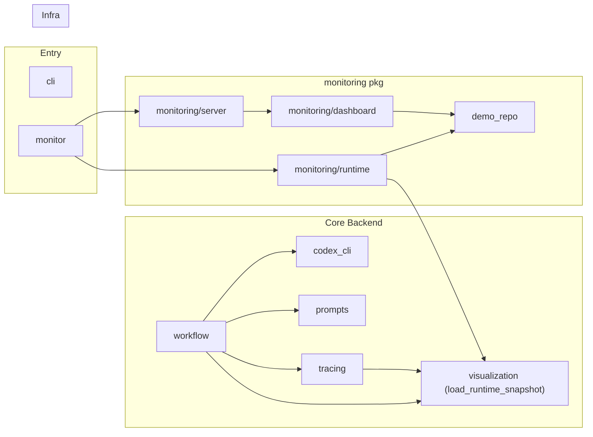

# `agent_system_coding` 整体前后端分离重构

## 背景

当前模块 9 个文件 + 1 个子包 `monitoring`，扁平堆在同一级目录里。分析后发现两个前后端混合问题：

| 问题 | 文件 | 症状 |
|---|---|---|
| **前端代码嵌在 Python 里** | `visualization.py` | ~200 行 CSS、~50 行 JS 以 f-string 形式生成 |
| **monitoring 子包已半分离** | `monitoring/` | HTML/CSS/JS 独立文件 ✅，但后端逻辑（`server.py`、`runtime.py`）和前端资源管理（`dashboard.py`）混在同一包 |

其余文件（`workflow.py`、`tracing.py`、`codex_cli.py`、`prompts.py`、`cli.py`、`demo_repo.py`）为纯后端逻辑。

---

## 现有依赖关系



---

## 重构后的目录结构

```
src/agent_system_coding/
├── __init__.py
├── cli.py                          # 不变
├── monitor.py                      # 不变（入口薄层）
│
├── backend/                        # [NEW] 纯 Python 后端逻辑
│   ├── __init__.py
│   ├── workflow.py                 # ← 原 workflow.py
│   ├── codex_cli.py                # ← 原 codex_cli.py
│   ├── prompts.py                  # ← 原 prompts.py
│   ├── tracing.py                  # ← 原 tracing.py
│   ├── snapshot.py                 # [NEW] 从 visualization.py 提取的数据采集逻辑
│   ├── writers.py                  # [NEW] 从 visualization.py 提取的文件写入逻辑
│   ├── demo_repo.py                # ← 原 demo_repo.py
│   └── server/                     # ← 原 monitoring 的后端部分
│       ├── __init__.py
│       ├── runtime.py              # ← 原 monitoring/runtime.py
│       └── http_handler.py         # ← 原 monitoring/server.py
│
└── frontend/                       # [NEW] 纯静态前端资源
    ├── __init__.py                 # 资源定位辅助（替代原 dashboard.py）
    ├── dashboard/                  # ← 原 monitoring/ 的前端资源
    │   ├── index.html              # ← 原 monitor_dashboard.html
    │   ├── style.css               # ← 原 monitor_dashboard.css
    │   └── app.js                  # ← 原 monitor_dashboard.js
    └── trace_viewer/               # [NEW] 从 visualization.py 剥离的前端
        ├── index.html              # HTML 结构（不再内嵌于 Python f-string）
        ├── style.css               # ~120 行 CSS
        └── app.js                  # 渲染逻辑 + live polling JS
```

---

## 关键设计决策

### 1. 接口契约：snapshot JSON

> [!IMPORTANT]
> 前后端通过 **snapshot JSON** 解耦。后端只产出 JSON 数据，前端只消费 JSON 渲染 UI。

`backend/snapshot.py` 暴露 `load_runtime_snapshot(runtime_dir) -> dict`，返回统一格式：

```json
{
  "runtime_dir": "...",
  "events": [...],
  "latest": {...},
  "tasks": [...],
  "batches": [...],
  "node_statuses": {...},
  "node_details": {...},
  "artifacts": [...],
  "conversations": [...],
  "graph_text": "..."
}
```

`frontend/trace_viewer/` 的 HTML 通过模板占位或 JS fetch 加载这份 JSON 来渲染。

### 2. 静态导出 vs Live 模式共用同一套前端

- **静态导出**：`writers.py` 生成 `trace-viewer.html` 时，将 snapshot JSON 以 `<script>` 注入 HTML，前端 JS 直接读取全局变量
- **Live 模式**：前端 JS 通过 `fetch('/api/runs/:id/snapshot')` 定时拉取

两种模式共用同一份 `index.html` + `style.css` + `app.js`。

### 3. 向后兼容

`visualization.py` 保留为**瘦转发层**，重新导出原有公共 API：

```python
# visualization.py（兼容层，最终可废弃）
from .backend.writers import write_graph_mermaid, write_latest_status, write_trace_report, write_trace_viewer_html
from .backend.snapshot import load_runtime_snapshot, render_trace_viewer_html
```

外部调用（`workflow.py`、`tracing.py`、`monitoring/runtime.py`）的 import 无需立即修改。

---

## 变更清单

| 操作 | 文件 |
|---|---|
| **移动** | `workflow.py` → `backend/workflow.py` |
| **移动** | `codex_cli.py` → `backend/codex_cli.py` |
| **移动** | `prompts.py` → `backend/prompts.py` |
| **移动** | `tracing.py` → `backend/tracing.py` |
| **移动** | `demo_repo.py` → `backend/demo_repo.py` |
| **拆分** | `visualization.py` → `backend/snapshot.py` + `backend/writers.py` + `frontend/trace_viewer/*` |
| **移动** | `monitoring/server.py` → `backend/server/http_handler.py` |
| **移动** | `monitoring/runtime.py` → `backend/server/runtime.py` |
| **拆分** | `monitoring/dashboard.py` → `frontend/__init__.py` |
| **移动** | `monitoring/*.html/css/js` → `frontend/dashboard/*` |
| **新建** | `frontend/trace_viewer/index.html` + `style.css` + `app.js` |
| **保留** | `visualization.py` 作为兼容转发层 |
| **更新** | `cli.py`、`monitor.py` 的 import 路径 |

---

## Verification Plan

### 自动验证

```bash
# 1. 确认所有 import 正确
python3 -c "from agent_system_coding.backend.workflow import run_workflow; print('OK')"
python3 -c "from agent_system_coding.visualization import load_runtime_snapshot; print('compat OK')"

# 2. 确认 monitor 入口正常启动（快速退出）
timeout 3 python3 -m agent_system_coding.monitor --help

# 3. 用 modular-arch 注册模块并验证无循环依赖
python3 .agents/skills/modular-arch/scripts/mod_arch.py check
```

### 手动验证

- 启动 `monitor` dashboard 确认 HTML/CSS/JS 正常加载
- 执行一次 workflow 确认 `trace-viewer.html` 正常生成
