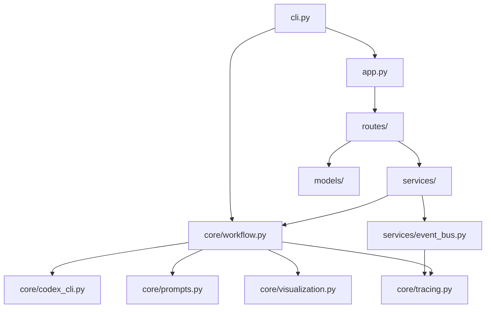

# 后端重构文档

> **状态**: 设计中 (Draft)
> **版本**: v0.1.0
> **最后更新**: 2026-03-15
> **接口契约**: [api-contract.md](./api-contract.md)
> **并行关系**: 与 [frontend-refactor.md](./frontend-refactor.md) Phase 1 并行开发

---

## 1. 业务目标

将 `src/agent_system_coding/` 下的平铺 Python 文件重构为 **FastAPI 后端服务**：

| 目标 | 描述 |
|------|------|
| 暴露 REST API | 将工作流引擎的能力通过 HTTP API 对外提供 |
| 实时状态推送 | 通过 WebSocket 向前端推送节点运行状态 |
| 解耦服务层 | 工作流引擎只关注业务逻辑，服务层只关注 HTTP/WS 协议 |
| 保持引擎纯净 | 原有 workflow / tracing / codex_cli / prompts 的核心逻辑不因 API 化而被污染 |

---

## 2. 目录结构

```
src/agent_system_coding/
├── backend/
│   ├── __init__.py
│   ├── app.py                   # FastAPI 应用入口
│   ├── config.py                # 配置管理（环境变量、默认值）
│   │
│   ├── core/                    # 核心引擎（从平铺文件迁入）
│   │   ├── __init__.py
│   │   ├── workflow.py          # ← 原 workflow.py
│   │   ├── tracing.py           # ← 原 tracing.py
│   │   ├── codex_cli.py         # ← 原 codex_cli.py
│   │   ├── prompts.py           # ← 原 prompts.py
│   │   └── visualization.py     # ← 原 visualization.py
│   │
│   ├── models/                  # Pydantic 数据模型（接口契约的代码实现）
│   │   ├── __init__.py
│   │   ├── workflow_models.py   # 工作流请求/响应模型
│   │   ├── trace_models.py      # Trace 事件模型
│   │   └── graph_models.py      # DAG 图结构模型
│   │
│   ├── routes/                  # FastAPI 路由
│   │   ├── __init__.py
│   │   ├── workflow.py          # /api/v1/workflow/* REST 端点
│   │   └── websocket.py         # /ws/v1/workflow/* WebSocket 端点
│   │
│   ├── services/                # 服务层（路由与核心之间的胶水）
│   │   ├── __init__.py
│   │   ├── workflow_service.py  # 工作流生命周期管理
│   │   └── event_bus.py         # 内部事件总线（连接 tracing → WS）
│   │
│   └── cli.py                   # 改造后的 CLI 入口（调用 app 或直接调引擎）
│
├── __init__.py                  # 模块初始化
└── (frontend/ 由前端文档管理)
```

---

## 3. 模块职责说明

### 3.1 `core/` — 核心引擎

**原则**: 零 FastAPI 依赖。`core/` 内部不允许 import FastAPI、Pydantic（除 dataclass 外）。

| 文件 | 职责 | 迁移说明 |
|------|------|----------|
| `workflow.py` | LangGraph 图定义 + 节点逻辑 + 并行调度 | 从根目录直接移入，内部 import 路径调整 |
| `tracing.py` | Trace 事件记录（JSON + JSONL + 实时文件） | 新增回调钩子，允许 event_bus 订阅事件 |
| `codex_cli.py` | Codex CLI 子进程封装 | 直接移入，无逻辑变更 |
| `prompts.py` | Prompt 模板构建 | 直接移入，无逻辑变更 |
| `visualization.py` | Mermaid 生成 + trace report 输出 | 直接移入，无逻辑变更 |

**核心变更**: `tracing.py` 新增 **事件回调机制**

```python
# tracing.py 新增
from typing import Callable

_event_listeners: list[Callable[[dict], None]] = []

def register_event_listener(listener: Callable[[dict], None]) -> None:
    _event_listeners.append(listener)

def _notify_listeners(event: dict) -> None:
    for listener in _event_listeners:
        listener(event)
```

这样 `services/event_bus.py` 可以注册监听器，将 trace 事件转发到 WebSocket。

### 3.2 `models/` — 数据模型

接口契约 `api-contract.md` 中每个请求/响应结构的 Pydantic v2 实现。

示例：

```python
# models/workflow_models.py
from pydantic import BaseModel

class WorkflowRunRequest(BaseModel):
    request: str
    repo_path: str = "."
    sandbox: str = "workspace-write"
    max_retries: int = 2
    model: str | None = None
    reasoning_effort: str = "high"

class WorkflowRunResponse(BaseModel):
    run_id: str
    status: str = "queued"
    created_at: str
```

### 3.3 `routes/` — 路由层

职责：HTTP/WS 协议处理 + 请求校验 + 调用 service 层。

路由层**不包含**业务逻辑，只做：
1. 解析请求参数
2. 调用 `services/` 层
3. 序列化响应

### 3.4 `services/` — 服务层

职责：编排核心引擎 + 管理运行生命周期。

| 文件 | 职责 |
|------|------|
| `workflow_service.py` | 管理 run_id → 工作流实例的映射、异步执行调度、状态查询 |
| `event_bus.py` | 事件总线：订阅 `tracing` 事件 → 广播到 WebSocket 连接 |

### 3.5 `cli.py` — CLI 入口

保留命令行入口能力，支持两种模式：
- `--serve`: 启动 FastAPI 服务器（面向前端）
- `--run`: 直接执行工作流（面向 CLI 用户，保持向后兼容）

---

## 4. 依赖关系



**层级规则**:
- `routes/` → `services/` → `core/`（单向依赖，不允许反向）
- `models/` 是纯数据定义，任何层都可以 import
- `core/` 不允许 import `routes/`、`services/`、`models/`

---

## 5. 迁移计划

| 原文件 | 新位置 | 迁移动作 | 状态 |
|--------|--------|----------|------|
| `workflow.py` | `backend/core/workflow.py` | 移动 + 调整 import | todo |
| `tracing.py` | `backend/core/tracing.py` | 移动 + 新增事件回调 | todo |
| `codex_cli.py` | `backend/core/codex_cli.py` | 移动 | todo |
| `prompts.py` | `backend/core/prompts.py` | 移动 | todo |
| `visualization.py` | `backend/core/visualization.py` | 移动 | todo |
| `cli.py` | `backend/cli.py` | 移动 + 新增 --serve 模式 | todo |
| `__init__.py` | `backend/__init__.py` | 重写 | todo |
| （新增） | `backend/app.py` | FastAPI 应用入口 | todo |
| （新增） | `backend/config.py` | 配置管理 | todo |
| （新增） | `backend/models/*.py` | Pydantic 模型 | todo |
| （新增） | `backend/routes/*.py` | REST/WS 路由 | todo |
| （新增） | `backend/services/*.py` | 服务层 | todo |

---

## 6. 技术选型

| 技术 | 版本 | 用途 |
|------|------|------|
| FastAPI | ≥0.115 | Web 框架 |
| Uvicorn | ≥0.30 | ASGI 服务器 |
| Pydantic | v2 | 数据校验与序列化 |
| LangGraph | 现有 | 工作流图引擎（不变） |

**新增依赖** (pyproject.toml):
```
fastapi>=0.115
uvicorn[standard]>=0.30
```

---

## 7. 退出条件

后端重构完成的验收标准：

- [ ] 所有 `api-contract.md` 定义的 REST 端点可通过 HTTP 调用
- [ ] WebSocket 端点能实时推送 trace 事件
- [ ] `core/` 内部零 FastAPI 依赖
- [ ] CLI `--run` 模式保持向后兼容
- [ ] `python -m uvicorn backend.app:app` 能启动服务
- [ ] 所有接口响应格式严格符合契约文档

---

## 8. 风险与注意事项

| 风险 | 影响 | 缓解措施 |
|------|------|----------|
| 工作流是同步阻塞的 | FastAPI 接口可能被长时间阻塞 | 使用 `asyncio.to_thread()` 或后台任务 |
| Codex CLI 依赖本地环境 | 部署环境需要安装 Codex | 保持 CLI 模式作为回退 |
| tracing 事件回调线程安全 | 并发写入可能丢事件 | 使用 `asyncio.Queue` 或线程安全队列 |

---

## 9. 开发节奏

详见 [前端重构文档](./frontend-refactor.md) 中的统一节奏规划。

后端在 Phase 1 中的交付优先级：

1. **P0**: `core/` 文件迁移 + import 路径修复（基础能力不丢失）
2. **P1**: `models/` + `routes/workflow.py` + `services/workflow_service.py`（REST API 可用）
3. **P2**: `routes/websocket.py` + `services/event_bus.py` + tracing 回调（实时推送可用）
4. **P3**: `config.py` + CORS + 生产就绪配置
