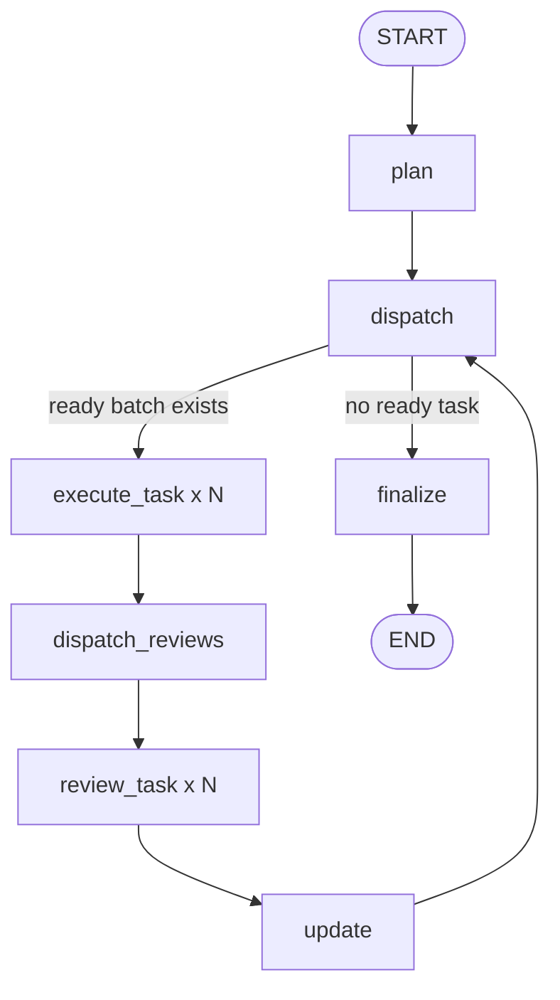

# LangGraph Demo Flow V2

这张图描述当前仓库中已经实现的 LangGraph MVP 流程。

对应代码见：

- [src/agent_system_coding/workflow.py](/home/wudizhe001/Documents/GitHub/agent-system-coding/src/agent_system_coding/workflow.py)
- [src/agent_system_coding/tracing.py](/home/wudizhe001/Documents/GitHub/agent-system-coding/src/agent_system_coding/tracing.py)

## Mermaid 图

## 节点说明

- `plan`
  - 调用 CodeX CLI 生成 `plan.json`
  - 初始化任务状态
  - 写入 trace

- `dispatch`
  - 从 plan 中挑选当前可执行任务 batch
  - 挑选规则是：依赖已满足，且 `allowed_paths` 之间不冲突
  - 如果选出多个互不冲突任务，就作为并行 batch 发出
  - 如果没有可执行任务，则转到 `finalize`

- `execute_task`
  - 每个 task 启动一个并行 worker
  - 为当前任务写出 `*.dispatch.json`
  - 调用 CodeX CLI 执行任务
  - 写出 `*.result.json`
  - 记录本轮观测到的新增改动文件

- `dispatch_reviews`
  - 收集当前 batch 的 execute 结果
  - 为每个 task 生成一个 review worker

- `review_task`
  - 每个 task 启动一个并行 reviewer
  - 调用 CodeX CLI 对当前任务做验收
  - 写出 `*.review.json`

- `update`
  - 汇总当前 batch 的 review 结果
  - 通过则标记为 `accepted`
  - 失败则按重试次数回到 `pending` 或标记 `blocked`
  - 回写 `plan.json`

- `finalize`
  - 汇总全部任务状态
  - 写出 `summary.json`
  - 给出最终 `done / blocked / incomplete`

## 状态回路

当前 demo v2 的核心回路是：

`plan -> dispatch -> execute_task(xN) -> dispatch_reviews -> review_task(xN) -> update -> dispatch`

只要还有任务可执行，这个回路就会继续。

其中：

- `execute_task(xN)` 表示同一批 ready tasks 并行执行
- `review_task(xN)` 表示同一批任务并行 review

当没有新的 ready task 时，流程进入：

`finalize -> END`

## 留痕文件

每个节点都会写 trace 到：

- `runtime/*/traces/events.jsonl`
- `runtime/*/traces/*.start.json`
- `runtime/*/traces/*.end.json`
- `runtime/*/traces/*.error.json`

这意味着每个环节是否执行、何时执行、执行后状态如何，都可以落盘追踪。
