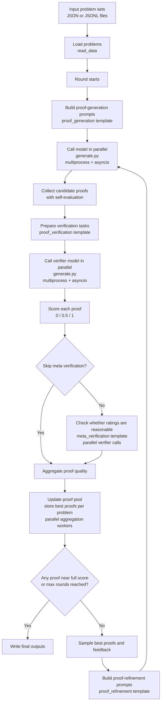

# DeepSeek-Math-V2 Inference Algorithm

这套代码的业务目标不是训练模型，而是批量评估模型在高难数学题上的证明能力，并通过多轮生成与校验持续提升证明质量。

关键脚本对应关系：

- `main.py`：编排整条多轮评测与精修流程。
- `generate.py`：并发调用模型接口，产出证明或评分结果。
- `math_templates.py`：定义生成、验证、复核、精修四类提示词模板。
- `utils.py`：负责题目读取、答案抽取、证明与自评拆分。
- `run.sh`：给出一套批量运行参数示例。

从结果上看，这是一条“生成证明 -> 自动审稿 -> 汇总高质量样本 -> 继续精修”的闭环流水线。

并行执行说明：

- `generate.py` 不是单线程调用，而是用多进程分发批次，再在每个进程内用 `asyncio.gather(...)` 并发请求模型接口。
- `main.py` 在 proof refinement 阶段还会用 `multiprocessing.Pool(...)` 并行准备 proof aggregation 任务。
